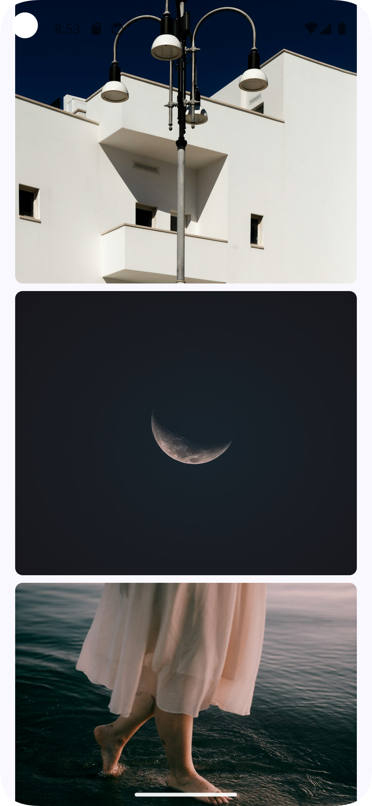

# Photos Splash

Photos Splash is an android app that shows you photos from [unsplash](https://unsplash.com/) built
with Jetpack Compose

# Technologies Used

- [Jetpack Compose](https://developer.android.com/develop/ui/compose): Android's modern UI Toolkit
- [Retrofit](https://square.github.io/retrofit/): A type safe HTTP client for Android and Java
- [Kotlinx Serialization](https://kotlinlang.org/docs/serialization.html): Cross platform framework
  for data serialization
- [Coroutines](https://kotlinlang.org/docs/coroutines-guide.html): For asynchronous programming

# Screenshots

<table>
  <tr>
    <td>
      
    </td>
    <td>
      
    </td>
  </tr>
</table>
